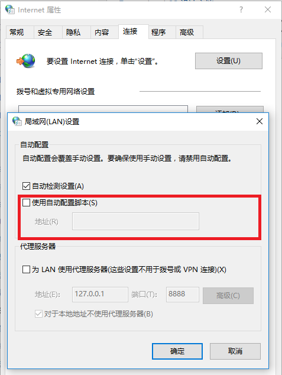
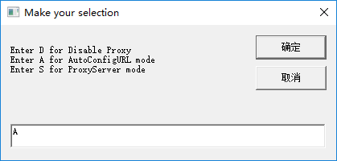
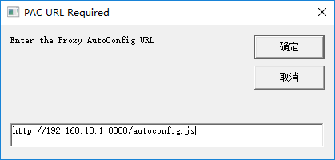

# Github Webhooks

## Deploy Webserver for receive Github Webhook event

* Run `make` to build openresty
* OpenResty default installed in `/usr/local/openresty`, make symbol link `ln -s $PWD/scripts /usr/local/openresty/nginx/scripts`
* Run nginx `nginx -c nginx.conf`, Note that the `PATH` already set for nginx path

Test Webhook

    $ curl -d '{"repository": {"full_name": "somebody/test"}}' -H "X-GitHub-Event: push"  http://localhost/api/github
    {"status":"ok","length":46,"repository":"somebody\/test","event":"push"}

# Windows代理自动配置(PAC)

PAC文件包含一个JavaScript形式的函数FindProxyForURL(url, host), 这个函数返回一个包含一个或多个访问规则的字符串。

在Windows下配置全局的PAC配置如下：

Internet选项 -> 连接 选项卡 -> 局域网设置 -> 使用自动配置脚本 -> 填入PAC地址 -> 确定

这里填写PAC文件的URL可以是任何有效的PAC文件URL. 也PAC文件部署在本地的webserver上，以下python代码实现了一个最小的webserver。将[autoproxy.js](autoproxy.js)放在当前目录下，运行以下命令即可将[autoproxy.js](autoproxy.js)部署在此webserver下。

    python -m SimpleHTTPServer 8000

也可通过本仓库提供的VBScript [setproxy.vbs](setproxy.vbs)快捷设置PAC:

# C# program

Nothong modified
